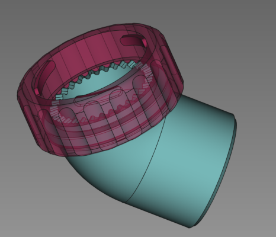
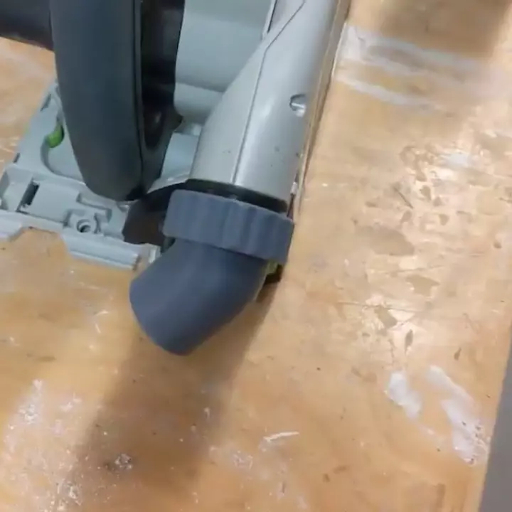

### TS55 Track Saw Outlet Port

## A position-locking outlet replacement nozzle for Festool track saws

The outlet port is designed to be printed in place, with a captive bayonet
nut and outlet with a 30 tooth radial spline. Nozzle can be positioned and
locks into place when locked onto the saw. Prevents the nozzle from
swinging down under the weight of the hose.

Included is an example project file which is carefully prepared to limit
support material for the radial spline. If the support material is
controlled, the support structure is ejected when the captive bayonet nut
is turned to the "left", leaving clean-up to an absolute minimum.

As this is a fairly precise Print-In-Place design, having your machine
well calibrated for both dimensional accuracy and keeping stringing to
a minimum is essential. The part in the example was printed on a Creatlity
Ender 3 v2, with close-to default settings, and Creality brand grey ABS.

