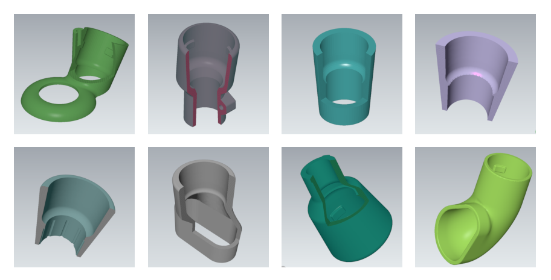

## Festool Compatible Adapters

### CAD and mesh files for dust collection adapters on various tools 

Ready-to-print files and working files to use Festool-compatible dust collectors on many different brands of sander, drills, and other applications.

Printed parts should have at least two millimeter wall thickness and dense infill, PLA is adequate.

Tools with tested and working adapter designs:
  - Bosch 11255VSR Hammer Drill
  - Bosch 1370 DEVS Orbital Sander
  - Bosch B7450 Belt Sander
  - Bosch ROS10 Orbital Sander
  - Dewalt D26441 Palm Sander
  - Dewalt DW680 Power Planer
  - [Festool TS55 Track Saw](https://raw.githubusercontent.com/UBC-AHVA/Festool_Nozzles/main/images/ts_demo.webp)
  - Makita 9404 Belt Sander
  - Makita BO5031 Orbital Sander
  - Porter Cable Model 371 Belt Sander
  - Standard 3" dust hose

Also included is a utility file (VacuumNozzle.FCStd) for knocking out the outlet port in new designs.
